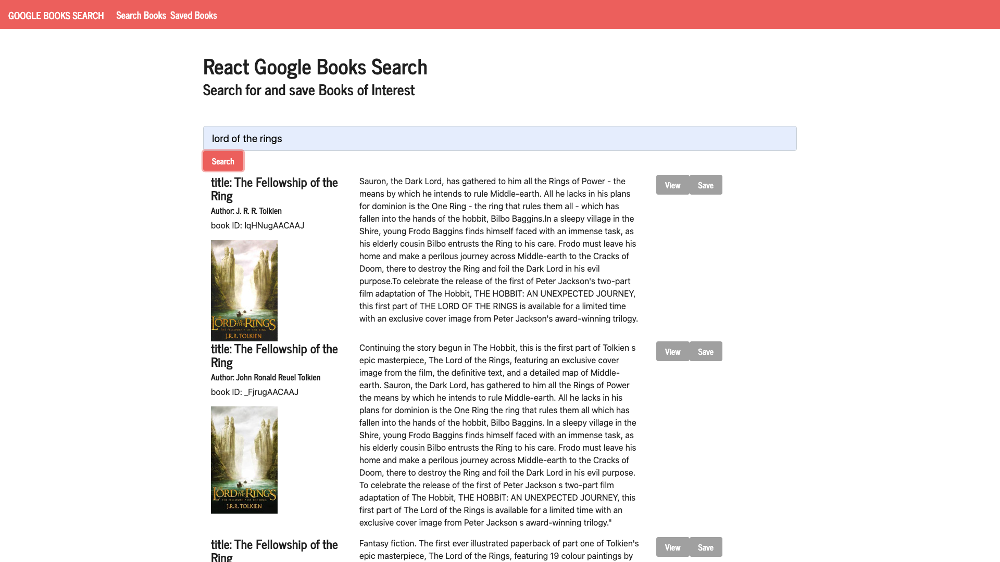

# Google-Books-Search
# Chad Tarpey


---

### Table of Contents
- [Description](#description)
- [How To Use](#how-to-use)
- [License](#license)
- [Author Info](#author-info)
---

---

# Google-Books-Search


---

### `npm start`

Runs the app in the development mode.\
Open [http://localhost:3000](http://localhost:3000) to view it in the browser.

The page will reload if you make edits.\
You will also see any lint errors in the console.

### `npm test`

Launches the test runner in the interactive watch mode.\
See the section about [running tests](https://facebook.github.io/create-react-app/docs/running-tests) for more information.

### `npm run build`

Builds the app for production to the `build` folder.\
It correctly bundles React in production mode and optimizes the build for the best performance.

The build is minified and the filenames include the hashes.\
Your app is ready to be deployed!

## Acceptance Criteria
```
When the user loads the page, they should be given the option to create a new workout or continue with their last workout.

The user should be able to:

  * Add exercises to a previous workout plan.

  * Add new exercises to a new workout plan.

  * View the combined weight of multiple exercises on the `stats` page.
```

# Purpose
---
 - You can search books using the google books api. 
 - Then you can save books of your choice to the database that loads up on your saved books page.
 - Then you can click the link the to view more about that book
 - Also delete button to remove the book from the database


# Built With these Technologies
* Mongodb
* Nodejs
* React
* Express
* JavaScript
* VS Code
* Robo3t


## Description
Google-Books-Search

---
## How To Use
- Visit   https://shrouded-bayou-81095.herokuapp.com/
- Google Chrome or any Web Browser
---
## References
- http://www.youtube.com
- http://www.github.com
- http://www.w3schools.com
- Vanderbilt/Triolgy Coding Bootcamp
---
## License
MIT License
Copyright (c) [2020] [Chad M Tarpey]
Permission is hereby granted, free of charge, to any person obtaining a copy
of this software and associated documentation files (the "Software"), to deal
in the Software without restriction, including without limitation the rights
to use, copy, modify, merge, publish, distribute, sublicense, and/or sell
copies of the Software, and to permit persons to whom the Software is
furnished to do so, subject to the following conditions:
The above copyright notice and this permission notice shall be included in all
copies or substantial portions of the Software.
THE SOFTWARE IS PROVIDED "AS IS", WITHOUT WARRANTY OF ANY KIND, EXPRESS OR
IMPLIED, INCLUDING BUT NOT LIMITED TO THE WARRANTIES OF MERCHANTABILITY,
FITNESS FOR A PARTICULAR PURPOSE AND NONINFRINGEMENT. IN NO EVENT SHALL THE
AUTHORS OR COPYRIGHT HOLDERS BE LIABLE FOR ANY CLAIM, DAMAGES OR OTHER
LIABILITY, WHETHER IN AN ACTION OF CONTRACT, TORT OR OTHERWISE, ARISING FROM,
OUT OF OR IN CONNECTION WITH THE SOFTWARE OR THE USE OR OTHER DEALINGS IN THE
SOFTWARE.
---
## Author Info
- Email - [chadtarpey@gmail.com](chadtarpey@gmail.com)
- Github - [github.com/chadtarpey615]


